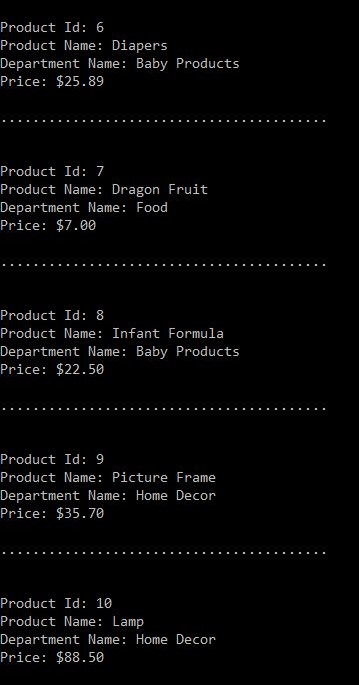
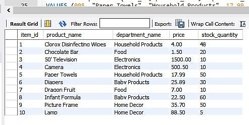

<h1>Bamazon</h1>

<h2>Intro to the App</h2> In this App, I created an Amazon-like storefront with the MySQL skills I have learned. This app will take orders from customers and deplete stock from the store's inventory.

<h2>Requirements</h2>
<ul>
  <li>Inquirer</li>
  <li>MySQL</li>
</ul>

<h2>App Functionality</h2>
<ul>
  <li>
    Using MySQL, I have created the database called bamazon and created a table inside the database called products.
  </li>
  <li>
    Within the products table, I added the following columns:
    <ul>
      <li>item_id (unique id for each product)</li>
      <li>product_name (name of product)</li>
      <li>department_name (department product belongs in)</li>
      <li>price (cost to customer)</li>
      <li>stock_quantity (how much of the product is available in stores)</li>
    </ul>
  </li>
  <li>
    After I populated the database, I added around 10 different "mock" products.
  </li>

   
  
    

  <li>
    I created an application called bamazonCustomer.js for customer's user experience.
    <ol>
      <li>
        When the user runs this application, a prompt will appear with the question: "Would you like to purchase an item?".
      </li>
        <ul>
          <li>
            If the user chooses "Yes Please!", they will be directed to the next step in this application.
          </li>
          <li>
            If they choose "No Thank You!", then connection will end immediately.
          </li>
         
          
          
            
          <li>
            A list of all available items for sale will display. The items will also display it's ids, names. and prices of the products for sale.
          </li>
           
          
          
            
        </ul>
      <li>
        Below the list of available items for sale, the app will prompt the user with two messages:
        <ul>
          <li>
            The first will ask the user the ID of the product they would like to buy.
          </li>
          <li>
            The second message should ask how many units of the product they would like to buy.
          </li>
           
          
          
            
        </ul>
      </li>
      <li>
        Once the user has placed the order, the application will check if the store has enough of the product to meet the user's request.
        <ul>
          <li>
            If not, the app will prevent the order from going through.
          </li>
          <li>
            If the store does have enough of the product, the user's order will be fulfilled. MySQL database will reflect the remaining quantity.
          </li>
          <li>
            Once the update goes through, the total cost for the purchase will appear. </li>
           
          
          
          
        </ul>
      </li>
    </ol>
</ul>
